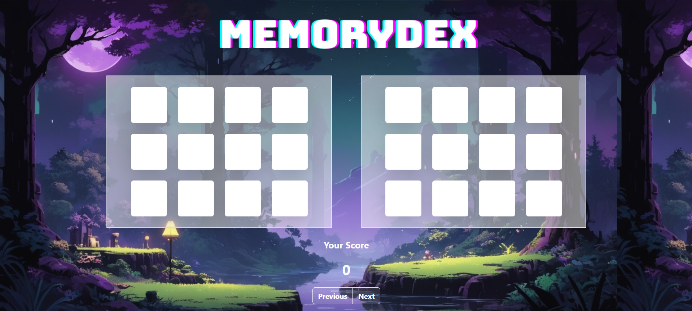

## 🧠 MemoryDex

A **Pokémon-themed memory game** built with **React**, where players match Pokémon from a pixelated retro interface inspired by classic Game Boy Advance visuals.

 <!-- Optional banner image -->

---

### 🎮 Features

* 🎨 Pixel-art-style UI with dark-themed retro background
* 🧩 Memory match game with two randomized Pokémon card grids
* 🔄 Shuffled card logic using the [Fisher-Yates Shuffle](https://en.wikipedia.org/wiki/Fisher%E2%80%93Yates_shuffle)
* 📦 Real-time data fetched from the [PokeAPI](https://pokeapi.co/)
* 💯 Score system with feedback on correct and incorrect matches
* 📱 Responsive layout with modern **Bootstrap 5** styling
* 🌌 Glassmorphism design elements for futuristic UI feel

---

### 🚀 Live Demo

> [🌐 Play MemoryDex Now](https://your-demo-link.com)

---

### 🛠️ Tech Stack

| Tech        | Description                       |
| ----------- | --------------------------------- |
| React       | Frontend JavaScript framework     |
| Bootstrap 5 | For responsive layout and styling |
| PokeAPI     | Pokémon data API                  |
| CSS / SCSS  | Custom styling and animations     |

---

---

### 🔧 Installation

```bash
# Clone the repository
git clone https://github.com/your-username/memorydex.git
cd memorydex

# Install dependencies
npm install

# Run the app
npm start
```

---

### 📁 Folder Structure

```
src/
├── 
│   ├── MemoryGame.jsx
│   └── imgs/
|       |_ background image
│   
├── App.jsx


